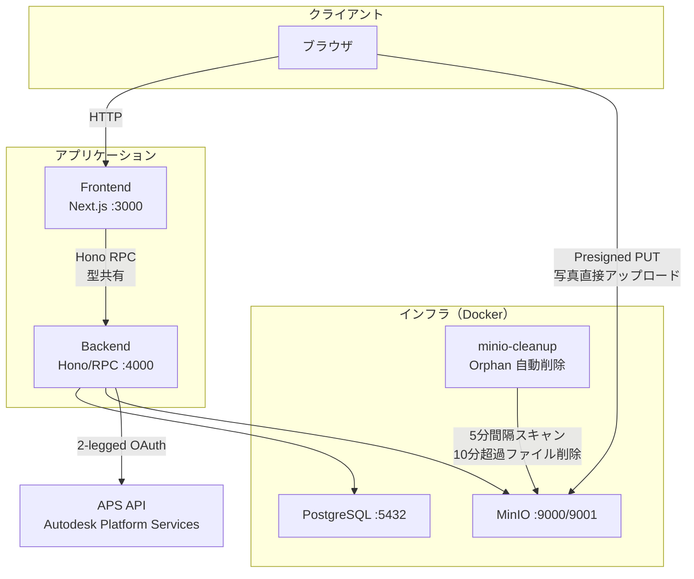

# アーキテクチャ設計

> 技術スタック・ディレクトリ構成・制約事項の一覧は `CLAUDE.md` を参照。
> 本ドキュメントでは設計判断の背景と詳細を記述する。

- [フロントエンド設計](./frontend.md)
- [バックエンド設計](./backend.md)

## 1. 全体構成図

### コンテナ構成（docker-compose）

| サービス      | イメージ           | 役割                      |
| ------------- | ------------------ | ------------------------- |
| frontend      | node:22-alpine     | Next.js App Router        |
| backend       | node:22-alpine     | Hono API サーバー         |
| db            | postgres:17-alpine | データ永続化              |
| minio         | minio/minio        | Blob ストレージ（S3互換） |
| minio-cleanup | minio/mc           | Orphanファイル自動削除    |

## 2. Hono RPC による型共有

backend の `AppType` を export し、frontend から import することで、
API のリクエスト/レスポンスの型をビルド時に共有する。
REST API でありながら、型安全な通信を実現する。

