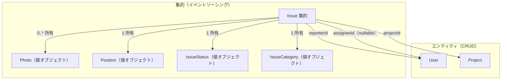
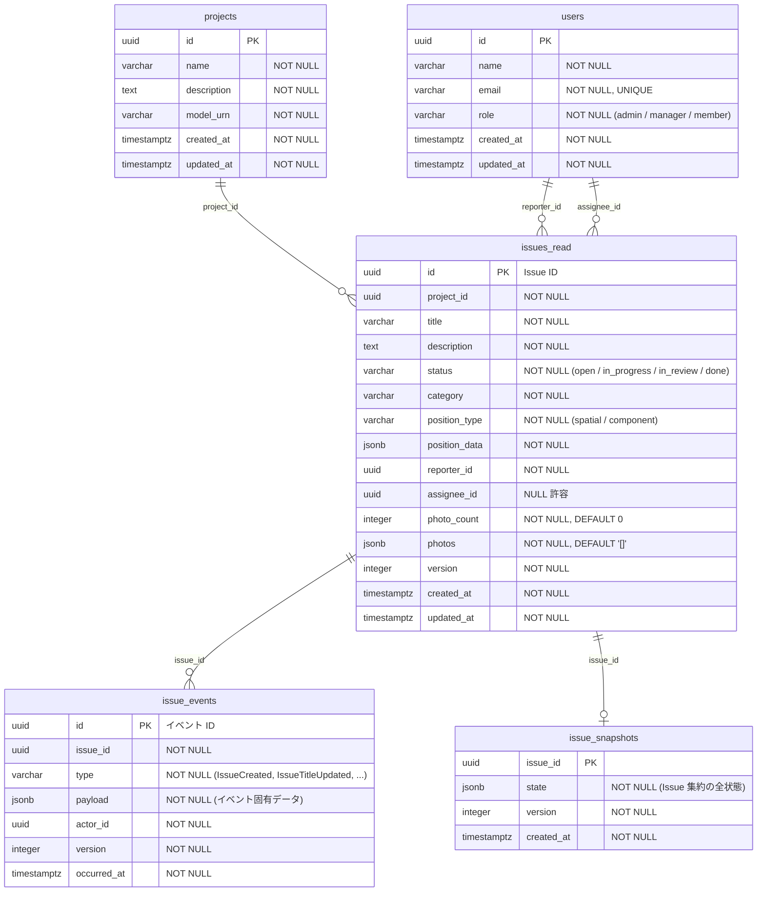
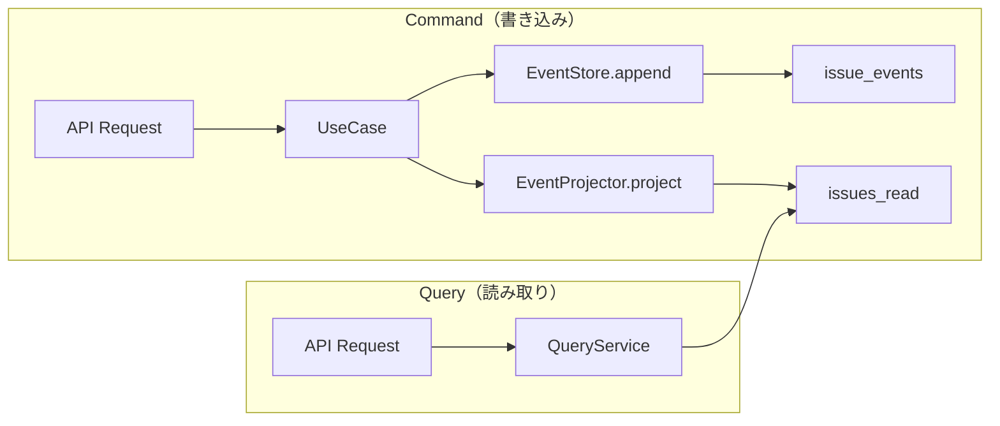

# ドメインモデル + ER 図

> ソース: `backend/src/domain/`（ドメイン型）、`backend/src/infrastructure/persistence/schema.ts`（DB スキーマ）

## 1. ドメインモデル概要



### 永続化方式の使い分け

| エンティティ | 方式 | 理由 |
|---|---|---|
| Issue | イベントソーシング | 状態遷移の履歴・監査証跡が業務上必要 |
| User | CRUD | 状態変更の履歴は不要 |
| Project | CRUD | 状態変更の履歴は不要 |

---

## 2. ER 図（物理テーブル）



---

## 3. テーブル詳細

### users

User エンティティの CRUD テーブル。

| カラム | 型 | 制約 | 説明 |
|--------|------|------|------|
| `id` | uuid | PK | UUID v7 |
| `name` | varchar(255) | NOT NULL | 表示名 |
| `email` | varchar(255) | NOT NULL, UNIQUE | メールアドレス |
| `role` | varchar(20) | NOT NULL | `admin` / `manager` / `member` |
| `created_at` | timestamptz | NOT NULL | 作成日時 |
| `updated_at` | timestamptz | NOT NULL | 更新日時 |

### projects

Project エンティティの CRUD テーブル。1 プロジェクト = 1 施工現場 = 1 APS モデル。

| カラム | 型 | 制約 | 説明 |
|--------|------|------|------|
| `id` | uuid | PK | UUID v7 |
| `name` | varchar(255) | NOT NULL | プロジェクト名 |
| `description` | text | NOT NULL | 説明 |
| `model_urn` | varchar(500) | NOT NULL | APS モデル URN |
| `created_at` | timestamptz | NOT NULL | 作成日時 |
| `updated_at` | timestamptz | NOT NULL | 更新日時 |

### issue_events（イベントストア）

Issue 集約の全状態変化をイベントとして追記保存する。更新・削除は行わない。

| カラム | 型 | 制約 | 説明 |
|--------|------|------|------|
| `id` | uuid | PK | イベント ID（UUID v7） |
| `issue_id` | uuid | NOT NULL | 対象の Issue ID |
| `type` | varchar(50) | NOT NULL | イベント型（後述） |
| `payload` | jsonb | NOT NULL | イベント固有のデータ |
| `actor_id` | uuid | NOT NULL | 操作者の User ID |
| `version` | integer | NOT NULL | 集約内の連番 |
| `occurred_at` | timestamptz | NOT NULL | 発生日時 |

**ユニーク制約**: `(issue_id, version)` — 楽観的同時実行制御に使用。同じ Issue に対して同じ version のイベントが2つ書き込まれると制約違反になる。

**イベント型と payload**

| type | payload |
|------|---------|
| `IssueCreated` | `{ projectId, title, description, status, category, position, reporterId, assigneeId, photos }` |
| `IssueTitleUpdated` | `{ title }` |
| `IssueDescriptionUpdated` | `{ description }` |
| `IssueStatusChanged` | `{ from, to }` |
| `IssueCategoryChanged` | `{ category }` |
| `IssueAssigneeChanged` | `{ assigneeId }` |
| `PhotoAdded` | `{ photo: { id, fileName, storagePath, phase, uploadedAt } }` |
| `PhotoRemoved` | `{ photoId }` |

### issues_read（CQRS 読み取りモデル）

`EventProjector` がイベントから同期投影する非正規化テーブル。クエリ側はこのテーブルのみ参照する。

| カラム | 型 | 制約 | 説明 |
|--------|------|------|------|
| `id` | uuid | PK | Issue ID |
| `project_id` | uuid | NOT NULL | プロジェクト ID |
| `title` | varchar(255) | NOT NULL | タイトル |
| `description` | text | NOT NULL | 説明 |
| `status` | varchar(20) | NOT NULL | ステータス |
| `category` | varchar(30) | NOT NULL | 種別 |
| `position_type` | varchar(20) | NOT NULL | `spatial` / `component` |
| `position_data` | jsonb | NOT NULL | 座標データ（後述） |
| `reporter_id` | uuid | NOT NULL | 報告者 ID |
| `assignee_id` | uuid | NULL 許容 | 担当者 ID |
| `photo_count` | integer | NOT NULL, DEFAULT 0 | 写真枚数 |
| `photos` | jsonb | NOT NULL, DEFAULT '[]' | 写真一覧（後述） |
| `version` | integer | NOT NULL | 最新イベント version |
| `created_at` | timestamptz | NOT NULL | 作成日時 |
| `updated_at` | timestamptz | NOT NULL | 最終更新日時 |

**インデックス**: `project_id`, `status`, `category`, `assignee_id`

**JSONB カラムの構造**

`position_data`:
```jsonc
// spatial の場合
{ "x": 1.0, "y": 2.0, "z": 3.0 }

// component の場合
{ "dbId": 123, "x": 1.0, "y": 2.0, "z": 3.0 }
```

`photos`:
```json
[
  {
    "id": "uuid",
    "fileName": "IMG_001.jpg",
    "storagePath": "confirmed/{issueId}/before/{photoId}.jpg",
    "phase": "before",
    "uploadedAt": "2026-04-10T00:00:00.000Z"
  }
]
```

### issue_snapshots

Issue 集約の状態スナップショット。`rehydrate` の全イベント再生を回避する最適化用（現時点では未使用）。

| カラム | 型 | 制約 | 説明 |
|--------|------|------|------|
| `issue_id` | uuid | PK | Issue ID |
| `state` | jsonb | NOT NULL | Issue 集約の全状態 |
| `version` | integer | NOT NULL | スナップショット時点の version |
| `created_at` | timestamptz | NOT NULL | スナップショット作成日時 |

---

## 4. 値オブジェクト

### Position（判別共用体）

```
Position = SpatialPosition | ComponentPosition

SpatialPosition  { type: "spatial",   worldPosition: { x, y, z } }
ComponentPosition{ type: "component", dbId: number, worldPosition: { x, y, z } }
```

- `spatial`: 3D 空間の任意の点（空間指摘）
- `component`: BIM 部材に紐づく位置（部材指摘）。`dbId` で APS Viewer の部材を特定
- 両方とも `worldPosition` を持つため、ピン描画・カメラ移動は共通処理で扱える

### IssueStatus（状態遷移マシン）

```
open → in_progress → in_review → done
                      ↓ (差し戻し)
                  in_progress
```

遷移ルールは `domain/valueObjects/issueStatus.ts` の隣接マップで定義。不正な遷移はドメイン層で防止。

### IssueCategory

| 値 | 意味 |
|----|------|
| `quality_defect` | 品質不良 |
| `safety_hazard` | 安全不備 |
| `construction_defect` | 施工不備 |
| `design_change` | 設計変更 |

### Photo（Issue 集約の値オブジェクト）

| フィールド | 型 | 説明 |
|-----------|------|------|
| `id` | PhotoId | UUID v7 |
| `fileName` | string | 元のファイル名 |
| `storagePath` | string | MinIO 上のパス（`confirmed/{issueId}/{phase}/{photoId}.{ext}`） |
| `phase` | `"before"` \| `"after"` | 是正前 / 是正後 |
| `uploadedAt` | Date | アップロード日時 |

---

## 5. CQRS データフロー



- **書き込み**: イベントを `issue_events` に追記し、同一トランザクション内で `issues_read` に同期投影
- **読み取り**: `issues_read` から直接取得。イベントストアや集約を経由しない
- 書き込みと読み取りで参照するテーブルが異なるため、独立してスキーマ・インデックスを最適化できる
